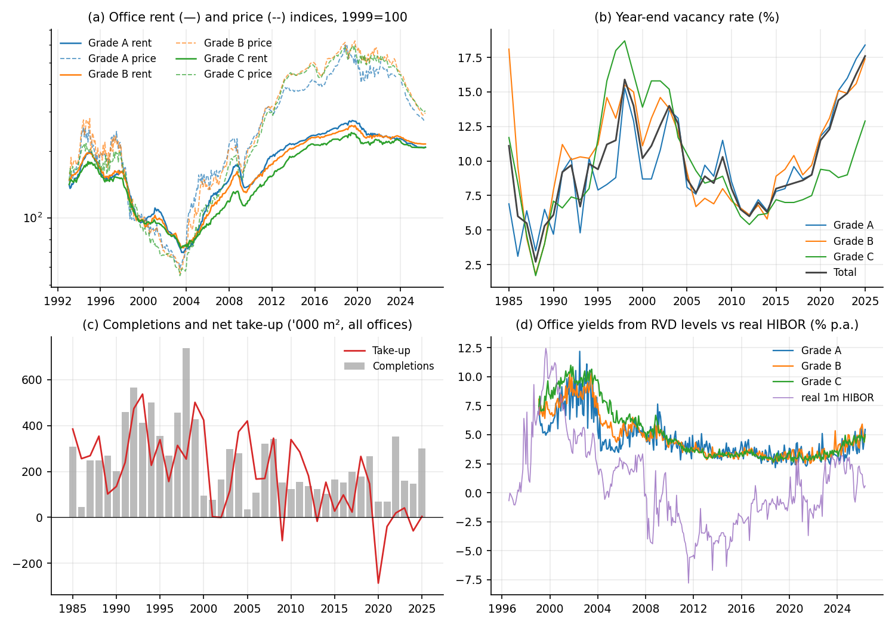

# Hong Kong Property Market Research

Two empirical studies of Hong Kong housing and office markets, combining
interest-rate models, time-series diagnostics, rolling forecast comparisons,
and office vacancy scenarios. The Python code covers data validation,
econometric estimation, simulation, and figures.



## Studies and results

| Study | Questions | Methods |
| --- | --- | --- |
| [Housing](hk-housing/src) | Price dynamics, rates and fundamentals, policy events, forecast accuracy | Recursive right-tailed ADF tests, cointegration and error correction, interrupted time series, local projections, rolling forecasts |
| [Offices](hk-office/src) | Rent adjustment, vacancy, supply absorption, district differences | Present-value decomposition, vacancy adjustment and state-space models, stock-flow scenarios, structural breaks, rolling forecasts |

Both monthly panels contain 400 observations from January 1993 through
April 2026. Some office analyses use longer quarterly and annual histories.
Results reflect the original 2026 source snapshot, rather than a live update.
The numbers below come from the saved results in each study's `output/`
folder. The exceptions are the standard errors of the smoothed natural
vacancy path, recomputed from the office data and model, and the
scikit-learn 1.9.1 sensitivity rerun of the housing forecasts.
P-values are not adjusted for the many specifications tested.

## Main findings

### Housing

**Explosive episodes** ([bubble tests](hk-housing/output/bubbles.json),
[figure](hk-housing/figures/fig3_bsadf.png))

- One-lag GSADF tests over 400 months find no robust bubble. Only real
  prices exceed the 5% Monte Carlo critical value (2.48 vs 2.22), and the
  volatility-robust wild-bootstrap p-values are 0.26 (nominal), 0.16 (real)
  and 0.44 (price–rent). With zero lags, the nominal and price–rent statistics
  exceed 2.185 (2.93, 3.03). Failing to reject does not prove absence.
- BSADF date-stamping flags seven nominal-price runs (1997–2018), one
  six-month price–rent run (February–July 2018) and a 22-month real-price run
  (September 2023–June 2025) in which real prices fell about 15%, most
  steeply at the start (about 2% a month to February 2024, slowing after):
  a sharp decline, not a boom. Runs are dated even where the global test
  does not reject, so treat them as descriptive.

**Long-run equilibrium** ([estimates](hk-housing/output/longrun.json),
[figure](hk-housing/figures/fig4_equilibrium.png))

- Real prices show no detectable long-run link to real income and the real
  prime rate: ARDL bounds F = 1.19, below the two-regressor 5% lower bound
  (3.80), or 0.72 against 3.23 with housing stock per capita added;
  error-correction t = −1.46; Gregory–Hansen never rejects. Johansen on price,
  income and housing stock per capita rejects no cointegration (trace 34.2 vs
  29.8), but only with an implausible income elasticity of about 12.9.
- The price–rent ratio and the real 1-month HIBOR give ARDL bounds F = 5.96,
  just above the one-regressor 5% upper bound of 5.72 (upper-bound
  p = 0.041). Ending the sample in 2019 gives 5.71, a hair below that bound
  (p = 0.050), so the pre-2019 result is borderline. The DOLS
  semi-elasticity is −0.049 per percentage point. The error-correction
  coefficient implies a half-life near 59 months, but its t = −2.62 falls
  short of the 5% bounds. Gregory–Hansen does not reject, and the relation
  disappears with the real prime rate (F = 3.52 on the same sample) or a
  composite funding rate (F = 3.98).

**Stamp-duty measures** ([estimates](hk-housing/output/policy.json),
[figure](hk-housing/figures/fig5_lp_irfs.png))

- Pooled local projections over four 2010–2016 stamp-duty tightenings show
  transaction volume about 43% lower after 12 months (95% CI −58% to −22%),
  insignificant from 15 months. Nominal prices did not fall: +3.8% at 12 months
  (insignificant) and +14.9% at 24 months (95% CI +1.5% to +30%).
  Interrupted-time-series dummies are all insignificant at 5%. These are
  associations, not causal effects.
- After the February 2024 abolition, volume was 193% higher two months later
  and 150% higher after 24 months. Nominal prices rose 2.6% in the first two
  months (95% CI +1.4% to +3.9%), then fell to 6.5% below their starting
  level after 12 months (95% CI −12.0% to −0.6%). This is a single event, so its narrow confidence bands are not
  credible, and the policy cannot be separated from concurrent rate and
  market shocks.

**Forecasting** ([summary](hk-housing/output/oos_summary.csv),
[figure](hk-housing/figures/fig6_forecast.png))

- Across 72 origins spaced two months apart (May 2013–March 2025),
  forecasting the log real price index, only gradient boosting at one month
  beats the random walk at 5%: RMSE **0.0162** vs **0.0188** (**13.6% lower**),
  Diebold–Mariano–HLN p = 0.0365. The p-value is unadjusted for 12
  model–horizon comparisons. The result depends on the pinned scikit-learn
  1.8.0: with 1.9.1 the ratio is 0.878 and p = 0.073.
- Autoregressive and error-correction forecasts cut 1- and 3-month RMSE by
  6–9%, but none is significant (p ≥ 0.117). The error-correction forecasts
  use the income and prime-rate relation, not the price–rent and HIBOR one. At 12 months the random walk has
  the lowest RMSE, and gradient boosting is significantly worse (RMSE 63%
  higher, p = 0.017). None of this measures a trading return.

### Offices

**Valuations and interest rates** ([estimates](hk-office/output/longrun.json),
[figure](hk-office/figures/fig2_caprate_channel.png))

- Neither ARDL bounds (F = 3.31, upper-bound p = 0.27) nor Johansen (trace
  13.8 vs 15.5 at 5%) finds cointegration between the Grade A log price–rent
  ratio and the real 1-month HIBOR. The all-grade ratio's F = 4.26 (p = 0.14)
  is also below the one-regressor 5% lower bound (4.92). Evidence that office valuations price
  off real rates is weak, although non-rejection does not prove there is no
  link. An unrestricted system of real price, real rent and real HIBOR does
  have one cointegrating vector (trace 37.1 vs 29.8); the ratio tests above
  impose price–rent proportionality, which that system does not.
- Against the US 10-year Treasury yield less Hong Kong inflation, the tests
  disagree: Johansen rejects no cointegration (trace 18.2 vs 15.5), ARDL
  bounds does not (F = 1.05). A quarterly Campbell–Shiller decomposition
  assigns the price–rent ratio's variance mainly to expected future returns
  (share 1.09, of which the real prime rate −0.15) rather than expected rent
  growth (−0.09). The bootstrap 95% interval for the rent-growth share is
  wide (−0.72 to 0.61).

**Natural vacancy rate** ([estimates](hk-office/output/vacancy.json),
[figure](hk-office/figures/fig3_vacancy_rent.png))

- Hendershott rent-adjustment regressions on annual data (n = 39, 1986–2025)
  put the natural vacancy rate at 9.2% (Grade A), 10.4% (B), 9.7% (C) and
  10.1% (total). The estimates are imprecise: Grade A's adjustment speed is
  insignificant (t = 1.17). Its bootstrap 95% interval, from the 86% of draws
  with a positive adjustment speed, spans −8.8% to 19.0% (total market: 0.6%
  to 15.9%, from 93% of draws).
- A Kalman local-level model (adjustment speed fixed at the OLS value) finds
  the natural rate flat for Grades A and B. Grade C fell from 12.8% to 6.5%,
  and the total from 14.4% to 9.5% (first versus last five-year means). The
  total's smoothed path moved from 8.5% in 2019 to 10.2% in 2025, a shift well
  inside its standard error (about 4–5 points) that no single grade shows. End-2025
  vacancy (Grade A 18.4%, total 17.6%) exceeds the OLS estimates by 9.2 and
  7.5 points.

**Absorbing the vacancy overhang** ([scenarios](hk-office/output/stockflow.json),
[figure](hk-office/figures/fig4_simulation.png))

- Completions fall, not rise, with lagged real prices (elasticity −0.37,
  t = −2.46), so supply enters as exogenous scenarios. Occupied-stock demand
  (DOLS) has income elasticity 0.79 and rent elasticity −0.20. Its
  error-correction speed is small and insignificant (−0.087, t = −1.0). The
  simulation floors it at 0.10 a year, slightly above the estimate, and
  absorption is still slow.
- Treating the end-2025 demand shortfall (occupancy 7.6% below the historical
  schedule) as permanent, simulated base-case total vacancy is **15.4%** in
  2035, above the fitted **10.1%** natural rate. Cutting completions to 30% of
  the 2021–25 pace reaches it by 2035 (base GDP) or 2033 (strong GDP). With
  faster adjustment (upper-bound speed 0.26) the base case normalizes in 2034.
  These are conditional simulations, not forecasts.

**District structure** ([estimates](hk-office/output/breaks.json),
[figure](hk-office/figures/fig5_regimes_districts.png))

- Bai–Perron (BIC) dates breaks in the log Central/Kwun Tong Grade A rent
  premium to September 2016 and July 2021. The premium rose from 1.07 to 1.18
  log points, then fell to 1.05, near its 2013–16 level; BIC barely prefers
  two breaks over three. Markov switching finds calm and volatile rent-growth
  regimes, each lasting about 13–14 months.
- Across all observed districts, dispersion of log Grade A rents relative to
  Central averages 0.250 before 2019 and 0.319 since, but only because Kwun
  Tong, about 1.1 log points below Central, enters the panel in February 2013.
  On balanced panels, which hold the district set fixed, dispersion edged
  down: 0.334 (February 2013–2018) vs 0.318 (2019 on) with all seven districts
  (Levene p = 0.89), and 0.232 (1999–2018) vs 0.221 excluding Kwun Tong
  (p = 0.07). Four of six districts are Engle–Granger cointegrated with
  Central at 5% (not Quarry Bay or Tsim Sha Tsui).

**Forecasting** ([summary](hk-office/output/oos_summary.csv))

- Over 132 expanding-window origins (May 2014 to April 2025), no model
  significantly beats a random walk for log real Grade A rents. The random walk
  with drift has the lowest RMSE ratios (0.99, 0.95, 0.89 at 1, 3 and 12 months)
  but unadjusted DM–HLN p ≥ 0.30. Error-correction and gradient-boosting
  forecasts do worse at every horizon.

## How the code fits together

Each study runs as a sequence of scripts, and every estimation script writes
its results to `output/`, so any step can be rerun and inspected on its own.
Office scripts read the processed panels from `data/processed/`. Housing
scripts rebuild the panel in memory from the raw files with
`pipeline.build_panel()`.

```text
input_manifest.json             required agency inputs, schemas and snapshot hashes
scripts/check_inputs.py         checks the inputs are present (optionally byte-identical)
        │
<study>/src/pipeline.py         parses agency workbooks and API extracts, splices and
        │                       deflates series, and stops on missing or duplicated months
        │                       (offices also on implausible vacancy and yield values)
        │                       → data/processed/*.csv
        ▼
housing  psy.py (numba PSY engine)  → run_bubbles.py      explosive-episode tests
         longrun.py                 → run_longrun.py      unit roots, cointegration, ECM
         policy.py                  → run_policy.py       interrupted time series, local projections
         forecast.py                → run_forecast.py     rolling five-model comparison
                                      run_robustness.py   aggregation, lag and segment checks
offices  longrun.py    cap-rate channel: cointegration and Campbell–Shiller decomposition
         vacancy.py    natural vacancy rate: Hendershott regressions and Kalman path
         stockflow.py  supply and demand estimation, four-quadrant scenario simulation
         breaks.py     Bai–Perron breaks, Markov switching, district convergence
         forecast.py   → run_forecast.py   rolling five-model comparison
        │
        ▼
<study>/output/*.json|csv       every numerical result → make_figures.py → figures/*.png
                                                       → make_tables.py  → tables/*.md
```

The PSY recursive tests are implemented from scratch with numba and validated
by `hk-housing/src/test_psy.py`. The other estimators build on statsmodels,
arch, ruptures and scikit-learn.

## Run an offline example

Use Python 3.11. From this directory:

```sh
python3.11 -m venv .venv
. .venv/bin/activate
python -m pip install -r requirements.txt
python scripts/demo.py
python -m unittest discover -s tests -v
python hk-housing/src/test_psy.py
```

On Windows, activate with `.venv\Scripts\activate`. Dependencies are pinned
in `requirements.txt`. The demo uses explicitly synthetic monthly data and
prints a small forecast comparison; it needs no downloaded data or API key.
The tests check ADF statistics against statsmodels, forecast lag recursion,
calendar validation, and the arithmetic of the saved forecast results.
The separate PSY script checks exactness, simulated power, size, date-stamping,
and wild-bootstrap behavior. Initial numerical-library compilation can take
longer than subsequent runs.

## Reproduce the empirical studies

The full raw and processed datasets are not included. The
[input manifest](input_manifest.json) lists the **14 housing** and **13 office**
inputs, their required paths, schemas, source agencies, and snapshot hashes.
Sources are the Rating and Valuation Department, HKMA, Census and Statistics
Department, Land Registry, FRED, and World Bank.

Place your inputs at the listed paths under each study's `data/raw/` folder.
Some inputs are normalized CSVs: downloading a similarly named source file
alone is insufficient. The manifest describes the expected columns. This
release does not provide a complete download-and-normalize pipeline; original
snapshot inputs or equivalently prepared files are needed for full estimation.
New source vintages can revise past observations and change the results.

```sh
python scripts/check_inputs.py --study all
# Require byte-identical original inputs when checking exact replication:
python scripts/check_inputs.py --study all --strict-snapshot
```

With the housing inputs available, run in this order:

```sh
python hk-housing/src/pipeline.py
python hk-housing/src/run_bubbles.py
python hk-housing/src/run_longrun.py
python hk-housing/src/run_policy.py
python hk-housing/src/run_forecast.py
python hk-housing/src/run_robustness.py
python hk-housing/src/make_figures.py
python hk-housing/src/make_tables.py
```

For offices:

```sh
python hk-office/src/pipeline.py
python hk-office/src/longrun.py
python hk-office/src/vacancy.py
python hk-office/src/stockflow.py
python hk-office/src/breaks.py
python hk-office/src/run_forecast.py
python hk-office/src/make_figures.py
python hk-office/src/make_tables.py
```

Each script resolves paths from its own location. Estimation includes nested
rolling fits and simulation loops and can take substantially longer than the
demo. Running these commands overwrites that study's numerical results and
figures. Input data, generated tables, logs, caches, and PDF figure exports
are ignored by Git.

## Interpretation and verification

Forecasts use expanding training samples and evaluate 1-, 3-, and 12-month
horizons against random-walk, drift, autoregressive, error-correction, and
gradient-boosting models. The forecast ECM uses a static OLS long-run relation;
separate long-run research modules also estimate DOLS models.

These are retrospective, pseudo-out-of-sample evaluations using a single
source vintage. Housing income is interpolated before forecast splitting,
so the resulting information set is not a point-in-time reconstruction.
Overlapping forecast errors are handled by the implemented DM–HLN comparison,
but p-values are not adjusted across all research specifications. Policy
event estimates describe associations, and failure to reject a bubble test
does not prove the absence of a bubble.

ARDL bounds critical values and p-values come from the Pesaran–Shin–Smith
asymptotic tables for the actual number of regressors (5% bounds 4.92 and
5.72 with one regressor). statsmodels' `bounds_test` also counts the
dependent variable as a regressor, so the code keeps only its F statistic.
AIC chooses the lag orders among models that keep every regressor of a
specification.

Three corrections were made in September 2026, and the affected results
were rerun with the pinned `requirements.txt`. First, the saved bounds
critical values and p-values had been one regressor too lenient. Second,
when AIC dropped a regressor, the remaining lag orders were matched to the
wrong columns. The housing income, rate and housing-stock test had therefore
run on income and the rate alone, and the pre-2019 income and rate test on
income alone. Third, SADF had used no lag while GSADF and BSADF used one; all
three now use one. The office dispersion comparison is now also saved for
balanced district panels.

The ECM forecast originally iterated its two lagged changes in the wrong
order. It was corrected, and the ECM forecasts and summary statistics were
recomputed. Both input pipelines and every estimation script were then rerun
against the original local inputs. The housing results reproduce the saved
outputs to within 3e-9 (relative) and the office Kalman estimates to within
5e-5. The office Markov-switching fit now seeds its random start-parameter
search, so reruns reproduce it exactly. Unseeded reruns had moved the expected
regime durations by less than 0.01 months, and 31 different seeds all reach
the same maximum likelihood to within 1.3e-6. The complete forecast comparison
reproduces the saved forecasts to within 1e-14 under the library versions
that produced them
(numpy 1.26.4, pandas 2.3.0, scikit-learn 1.8.0). With the pinned
`requirements.txt`, it reproduces them to within 3e-9 for every model except
the autoregressive benchmark. Its forecasts, which rely on maximum-likelihood
ARIMA fits, differ by up to 6e-4 under numpy 2.

## Files

- `hk-housing/` and `hk-office/`: analysis source, numerical
  CSV/JSON results, and PNG figures.
- `scripts/`: synthetic demonstration and input checks.
- `tests/`: offline regression and saved-result checks.
- `input_manifest.json`: input schemas, source information, and checksums.

Unavailable scenario normalization years are represented as JSON `null`.
